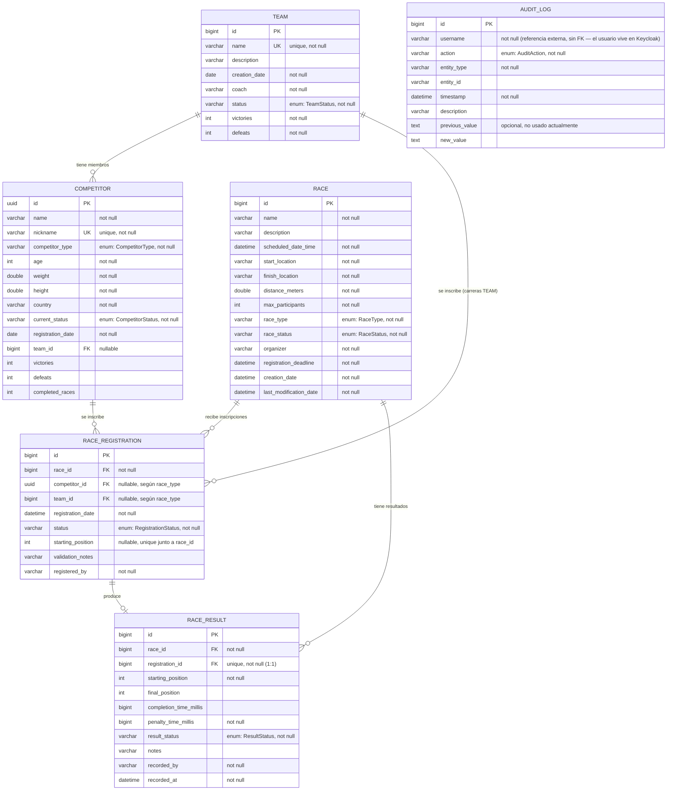

# 🐪 The Great EIA Camel vs. Dwarf Racing System

REST API developed in Java with Spring Boot for managing a racing competition involving camels and dwarfs.

The system manages competitors, teams, races, race registrations, official results, statistics, and standings while enforcing the business rules defined for the competition.

The project uses a layered architecture and PostgreSQL persistence through Docker.

---

## 📌 Project Status

### Implemented and manually tested

| Module / Feature | Status |
|---|---|
| Competitor management | ✅ Implemented and tested |
| Team management | ✅ Implemented and tested |
| Team ↔ Competitor relationship | ✅ Implemented and tested |
| Race management | ✅ Implemented and tested |
| Race lifecycle | ✅ Implemented and tested |
| Race Registration | ✅ Implemented and tested |
| Registration approval | ✅ Implemented and tested |
| Registration business rules | ✅ Implemented and tested |
| Race Results | ✅ Implemented and tested |
| Team results | ✅ Implemented and tested |
| Individual competitor results | ✅ Implemented and tested |
| Penalty and total time calculation | ✅ Implemented and tested |
| Points calculation | ✅ Implemented and tested |
| Competitor statistics | ✅ Implemented and tested |
| Team statistics | ✅ Implemented and tested |
| Standings | ✅ Implemented and tested |
| PostgreSQL persistence | ✅ Implemented and tested |
| PostgreSQL with Docker | ✅ Implemented and tested |
| HTTP error handling | ✅ Implemented |
| Validation | ✅ Implemented |
| Security / Role-based authorization (Keycloak) | ✅ Implemented |
| Audit Log | ✅ Implemented and tested |
| Automated tests | ✅ Implemented (16 tests, 15 required scenarios + context load) |
| Database indexes | ✅ Implemented |
| Entity-Relationship Diagram | ✅ Documented (`database-erd.md`) |
| Full backend Docker image | ⏳ Pending |
| GUI (Angular frontend) | ✅ Implemented |
| Final authentication/authorization integration | ✅ Implemented |

---

# 🛠️ Technologies

- Java 21+
- Spring Boot
- Spring Web
- Spring Data JPA
- Hibernate
- Jakarta Validation
- Spring Security (OAuth2 Resource Server, JWT)
- Keycloak (identity provider)
- springdoc-openapi / Swagger UI
- PostgreSQL
- Docker
- Docker Compose
- Gradle
- Lombok
- PowerShell for manual API testing
- IntelliJ IDEA

Frontend:

- Angular 18 (standalone components, signals)
- TypeScript
- Reactive Forms
- Custom SCSS design system (dark "desert sunset" theme)

---

# 🏗️ Architecture

The backend follows a layered architecture.

```text
Client / GUI
     │
     ▼
Controller
     │
     ▼
Service
     │
     ▼
Repository
     │
     ▼
JPA / Hibernate
     │
     ▼
PostgreSQL
```

Controllers are responsible for receiving HTTP requests and returning responses.

Business rules are implemented in the service layer.

Repositories provide persistence through Spring Data JPA.

Entities are not directly exposed through the REST API. DTOs and mappers are used between the API and persistence layers.

---

# 📂 Project Structure

The main backend structure is organized approximately as follows:

```text
src/main/java/com/parcialimplementacion/parcialenanosvscamellos/

├── common/
│   ├── config/       (OpenApiConfig)
│   └── exceptions/
│
├── security/
│   ├── config/        (SecurityConfig, JWT decoder, CORS)
│   ├── dto/            (LoginRequest, RefreshRequest, UserProfileResponse)
│   └── AuthController.java
│
├── competitor/
│   ├── controller/
│   ├── dto/
│   ├── entity/
│   ├── mapper/
│   ├── repository/
│   ├── service/
│   └── specification/
│
├── team/
│   ├── controller/
│   ├── dto/
│   ├── entity/
│   ├── mapper/
│   ├── repository/
│   ├── service/
│   └── specification/
│
├── race/
│   ├── controller/
│   ├── dto/
│   ├── entity/
│   ├── mapper/
│   ├── repository/
│   ├── service/
│   └── specification/
│
├── registration/
│   ├── controller/
│   ├── dto/
│   ├── entity/
│   ├── mapper/
│   ├── repository/
│   └── service/
│
├── result/
│   ├── controller/
│   ├── dto/
│   ├── entity/
│   ├── mapper/
│   ├── repository/
│   ├── service/
│   └── util/
│
└── standings/
    ├── controller/
    ├── dto/
    └── service/
```

---

# 🗄️ Database

The application currently uses PostgreSQL running inside Docker.

The database container is based on:

```text
postgres:16-alpine
```

Hibernate is currently configured with:

```properties
spring.jpa.hibernate.ddl-auto=update
```

This means that Hibernate creates or updates the required database tables automatically during development.

Tables created by the system:

```text
competitors
teams
races
race_registrations
race_results
audit_logs
```

`users`/`roles` are not tables here — Keycloak owns those.

## Entity-Relationship Diagram



Full version also kept at [`database-erd.md`](./database-erd.md).

---

# 🐳 PostgreSQL with Docker

The project contains a `compose.yml` file used to start PostgreSQL.

Start the database with:

```powershell
docker compose up -d
```

Check container status:

```powershell
docker compose ps
```

The database container should appear as healthy.

Example:

```text
db    postgres:16-alpine    Up (healthy)
```

---

# ⚙️ Environment Variables

Sensitive database credentials must not be committed to the repository.

The real `.env` file must remain ignored by Git.

Example `.env.example`:

```env
DB_HOST=127.0.0.1
DB_NAME=camel_racing
DB_USERNAME=your_database_user
DB_PASSWORD=your_database_password
DB_PORT=5433

# Keycloak
KEYCLOAK_ADMIN=admin
KEYCLOAK_ADMIN_PASSWORD=change_me
KEYCLOAK_PORT=8081
KEYCLOAK_REALM=camel-racing
KEYCLOAK_CLIENT_ID=camel-racing-app
KEYCLOAK_PUBLIC_URL=http://localhost:8081
# While the backend runs on the host (bootRun/IntelliJ, not yet dockerized),
# this must also be http://localhost:8081 — "keycloak" only resolves inside
# the Docker network. Switch it to http://keycloak:8080 once the backend
# gets its own service in compose.yml.
KEYCLOAK_INTERNAL_URL=http://localhost:8081

# CORS (frontend web, cuando exista)
CORS_ALLOWED_ORIGINS=http://localhost:5173,http://localhost:4200,http://localhost:3000
```

Create a local `.env` based on `.env.example`.

Example:

```text
.env.example  → committed
.env          → NOT committed
```

The `.gitignore` should contain:

```gitignore
.env
```

---

# 🔌 Database Configuration

The application uses environment variables in `application.properties`.

Example:

```properties
spring.application.name=ParcialEnanosvsCamellos

spring.config.import=optional:file:./.env[.properties]

spring.datasource.url=jdbc:postgresql://${DB_HOST:localhost}:${DB_PORT:5432}/${DB_NAME}
spring.datasource.username=${DB_USERNAME}
spring.datasource.password=${DB_PASSWORD}
spring.datasource.driver-class-name=org.postgresql.Driver

spring.jpa.hibernate.ddl-auto=update
spring.jpa.show-sql=true
spring.jpa.properties.hibernate.format_sql=true
spring.jpa.open-in-view=false

spring.web.error.include-stacktrace=never
spring.web.error.include-exception=false
```

---

# ▶️ Running the Application

## 1. Start PostgreSQL + Keycloak

From the project root:

```powershell
docker compose up -d
```

This starts two containers: the PostgreSQL database and Keycloak (with the
`camel-racing` realm, its three roles and its three test users already
imported from `keycloak/realm-export.json`).

Verify:

```powershell
docker compose ps
```

Both `db` and `keycloak` should appear as healthy. Keycloak can take
10-30 seconds to finish starting the first time.

Keycloak admin console (for administering the realm manually, not needed
for normal use): http://localhost:8081 — login with `KEYCLOAK_ADMIN` /
`KEYCLOAK_ADMIN_PASSWORD` from `.env`.

---

## 2. Configure database variables

The project can use the values contained in `.env`.

If necessary, the variables can also be configured directly in PowerShell before starting Spring Boot.

Example:

```powershell
$env:SPRING_DATASOURCE_URL="jdbc:postgresql://127.0.0.1:5433/camel_racing"
$env:SPRING_DATASOURCE_USERNAME="your_database_user"
$env:SPRING_DATASOURCE_PASSWORD="your_database_password"
```

Do not commit real passwords to GitHub.

---

## 3. Start Spring Boot

From the project root:

```powershell
.\gradlew bootRun
```

The application will be available at:

```text
http://localhost:8080
```

The terminal running `bootRun` must remain open.

Gradle may display something similar to:

```text
80% EXECUTING
```

while the server is running.

This is normal. It means Spring Boot is active and waiting for HTTP requests.

---

# ▶️ Running from IntelliJ (green Run button)

Works the same as `.\gradlew bootRun`. Just make sure `docker compose up -d`
is already running (`db` and `keycloak` as `Up (healthy)`) before clicking
Play.

---

# ✅ Automated Tests

16 automated tests (JUnit 5 + MockMvc), covering the 15 required scenarios.
Only PostgreSQL needs to be running.

```powershell
.\gradlew test
```

| Test class | Scenarios covered |
|---|---|
| `CompetitorApiTest` | Create a valid competitor · reject invalid weight · reject duplicated nickname |
| `RaceApiTest` | Create a valid race · reject a race scheduled in the past |
| `RegistrationApiTest` | Register an active competitor · reject a suspended competitor · reject a duplicated registration · reject registration after the deadline |
| `ResultApiTest` | Record a valid result · reject two winners in one race |
| `SecurityApiTest` | Prevent a viewer from creating a race · allow an administrator to create a race · 401 without a token · 404 for a missing resource |

---

# 🧪 Manual Testing

Manual integration tests were executed using PowerShell `Invoke-RestMethod`.

The process used was:

```text
PowerShell HTTP Request
        ↓
REST Controller
        ↓
Service
        ↓
Business Rules
        ↓
Repository
        ↓
Hibernate / JPA
        ↓
PostgreSQL
```

Database persistence was additionally verified directly using PostgreSQL commands inside the Docker container.

---

# 🧍 Competitors

Competitors can be created, queried, updated and assigned to teams.

Supported competitor types include:

```text
CAMEL
DWARF
```

Competitor status includes values such as:

```text
ACTIVE
RETIRED
```

The system also maintains statistics including:

```text
victories
defeats
completedRaces
```

---

## Example: Create Competitor

```powershell
$body = @{
    name = "Byte"
    nickname = "byte-camel"
    competitorType = "CAMEL"
    age = 10
    weight = 450.0
    height = 2.1
    country = "Colombia"
} | ConvertTo-Json
```

```powershell
Invoke-RestMethod `
    -Method Post `
    -Uri "http://localhost:8080/api/competitors" `
    -ContentType "application/json" `
    -Body $body
```

---

## Example: Get Competitors

```powershell
Invoke-RestMethod `
    -Method Get `
    -Uri "http://localhost:8080/api/competitors"
```

---

# 👥 Teams

Teams can be created and can contain competitors.

A competitor cannot simultaneously belong to multiple active teams.

Teams also maintain race statistics:

```text
victories
defeats
```

---

## Example: Create Team

```powershell
$teamBody = @{
    name = "The Five Exceptions"
    description = "Test team"
    coach = "Ada Coach"
} | ConvertTo-Json
```

```powershell
$team = Invoke-RestMethod `
    -Method Post `
    -Uri "http://localhost:8080/api/teams" `
    -ContentType "application/json" `
    -Body $teamBody
```

---

## Add Competitor to Team

```powershell
Invoke-RestMethod `
    -Method Post `
    -Uri "http://localhost:8080/api/teams/$teamId/members/$competitorId"
```

The relationship was verified directly in PostgreSQL.

---

# 🏁 Races

Races support a lifecycle controlled through race status.

Possible statuses include:

```text
DRAFT
OPEN_FOR_REGISTRATION
CLOSED_FOR_REGISTRATION
IN_PROGRESS
COMPLETED
CANCELLED
```

Valid lifecycle example:

```text
DRAFT
  ↓
OPEN_FOR_REGISTRATION
  ↓
CLOSED_FOR_REGISTRATION
  ↓
IN_PROGRESS
  ↓
COMPLETED
```

Cancellation is also supported from valid intermediate states.

---

## Important Race Rules

Some implemented rules include:

- A race cannot start without at least two approved participants.
- Registration must occur before the registration deadline.
- Registrations can only occur while the race is open.
- A completed race cannot continue changing state.
- A race cannot be completed without official results.
- A race in progress or completed cannot be deleted.
- Invalid state transitions are rejected.

---

## Example: Create Race

```powershell
$raceDate = (Get-Date).AddDays(7).ToString("yyyy-MM-ddTHH:mm:ss")
$deadline = (Get-Date).AddDays(6).ToString("yyyy-MM-ddTHH:mm:ss")

$raceBody = @{
    name = "First Mixed Race"
    description = "Integration test race"
    scheduledDateTime = $raceDate
    startLocation = "Universidad EIA"
    finishLocation = "Alto de Las Palmas"
    distanceMeters = 1000
    maxParticipants = 10
    raceType = "MIXED"
    organizer = "Test Organizer"
    registrationDeadline = $deadline
} | ConvertTo-Json
```

```powershell
$race = Invoke-RestMethod `
    -Method Post `
    -Uri "http://localhost:8080/api/races" `
    -ContentType "application/json" `
    -Body $raceBody
```

---

# 📝 Race Registration

Race Registration supports both:

```text
Individual Competitor
Team
```

Registration statuses:

```text
PENDING
APPROVED
REJECTED
CANCELLED
```

---

## Implemented Registration Rules

The system validates:

- Registration is only allowed for an open race.
- Registration must occur before the deadline.
- A competitor or team cannot be registered twice in the same race.
- Starting positions cannot be duplicated.
- Only eligible competitors and teams can register.
- Race participant type must be compatible with race type.
- A participant cannot participate individually and as part of a team in the same race.
- Rejected registrations require validation information.
- Race capacity must not be exceeded.

---

## Registration Endpoints

```text
POST   /api/races/{raceId}/registrations
GET    /api/races/{raceId}/registrations
GET    /api/registrations/{id}
PATCH  /api/registrations/{id}/approve
PATCH  /api/registrations/{id}/reject
DELETE /api/registrations/{id}
```

---

## Example: Register Team

```powershell
$teamRegistrationBody = @{
    teamId = $teamId
    startingPosition = 1
    registeredBy = "test-organizer"
} | ConvertTo-Json
```

```powershell
Invoke-RestMethod `
    -Method Post `
    -Uri "http://localhost:8080/api/races/$raceId/registrations" `
    -ContentType "application/json" `
    -Body $teamRegistrationBody
```

The initial registration status is:

```text
PENDING
```

---

## Approve Registration

```powershell
Invoke-RestMethod `
    -Method Patch `
    -Uri "http://localhost:8080/api/registrations/$registrationId/approve"
```

The new status becomes:

```text
APPROVED
```

---

# 🏆 Race Results

Official race results can only be created for approved participants while the race is:

```text
IN_PROGRESS
```

Supported result statuses:

```text
FINISHED
DISQUALIFIED
DID_NOT_FINISH
DID_NOT_START
```

Each result contains information such as:

```text
race
registration
starting position
final position
completion time
penalty time
result status
notes
recorded by
recorded timestamp
```

---

# ⏱️ Time Calculation

For finished participants:

```text
totalTimeMillis =
completionTimeMillis + penaltyTimeMillis
```

Example:

```text
completionTimeMillis = 65000
penaltyTimeMillis    = 1000

totalTimeMillis      = 66000
```

---

# 🥇 Result Rules

Implemented validations include:

- Results can only be entered while the race is `IN_PROGRESS`.
- Only approved registrations may receive official results.
- A registration can only have one official result.
- Normal final positions cannot be duplicated.
- Completion time must be positive.
- Only one participant may finish in position `1`.
- `FINISHED` requires a final position.
- `FINISHED` requires a completion time.
- A participant marked `DID_NOT_START` cannot have a completion time.
- Results cannot be modified once the race is completed.

---

# 🎯 Points System

The scoring table is:

| Position | Points |
|---:|---:|
| 1st | 10 |
| 2nd | 7 |
| 3rd | 5 |
| 4th | 3 |
| 5th | 1 |
| Other | 0 |

Only participants with:

```text
resultStatus = FINISHED
```

receive position points.

---

# 🏆 Result Endpoints

```text
POST /api/races/{raceId}/results
GET  /api/races/{raceId}/results
GET  /api/results/{id}
PUT  /api/results/{id}
```

---

## Example: Team Result

```powershell
$teamResultBody = @{
    registrationId = 1
    resultStatus = "FINISHED"
    finalPosition = 1
    completionTimeMillis = 60000
    penaltyTimeMillis = 0
    notes = "Team finished first"
    recordedBy = "test-organizer"
} | ConvertTo-Json
```

```powershell
Invoke-RestMethod `
    -Method Post `
    -Uri "http://localhost:8080/api/races/$raceId/results" `
    -ContentType "application/json" `
    -Body $teamResultBody
```

Expected result:

```text
finalPosition        : 1
completionTimeMillis : 60000
penaltyTimeMillis    : 0
totalTimeMillis      : 60000
resultStatus         : FINISHED
points               : 10
```

---

## Example: Individual Result

```powershell
$competitorResultBody = @{
    registrationId = 2
    resultStatus = "FINISHED"
    finalPosition = 2
    completionTimeMillis = 65000
    penaltyTimeMillis = 1000
    notes = "Competitor finished second"
    recordedBy = "test-organizer"
} | ConvertTo-Json
```

Expected result:

```text
finalPosition        : 2
completionTimeMillis : 65000
penaltyTimeMillis    : 1000
totalTimeMillis      : 66000
points               : 7
```

---

# 📊 Standings

The application automatically calculates standings from official race results.

Competitors and teams have independent rankings.

Available endpoints:

```text
GET /api/standings
GET /api/standings/competitors
GET /api/standings/teams
```

---

## Example

```powershell
$standings = Invoke-RestMethod `
    -Method Get `
    -Uri "http://localhost:8080/api/standings"

$standings | ConvertTo-Json -Depth 6
```

Example output:

```json
{
  "competitors": [
    {
      "rank": 1,
      "name": "Null Pointer",
      "nickname": "null-pointer",
      "points": 7,
      "victories": 0,
      "secondPlaces": 1,
      "thirdPlaces": 0,
      "racesWithResults": 1
    }
  ],
  "teams": [
    {
      "rank": 1,
      "name": "The Five Exceptions",
      "points": 10,
      "victories": 1,
      "secondPlaces": 0,
      "thirdPlaces": 0,
      "racesWithResults": 1
    }
  ]
}
```

---

# 📈 Statistics

Official results automatically update participant statistics.

For competitors:

```text
victories
defeats
completedRaces
```

Example tested result:

```text
Null Pointer

victories      : 0
defeats        : 1
completedRaces : 1
```

For teams:

```text
victories
defeats
```

Example tested result:

```text
The Five Exceptions

victories : 1
defeats   : 0
```

---

# 🚫 Business Rule Error Handling

The application uses centralized exception handling.

Expected HTTP statuses include:

```text
400 Bad Request
404 Not Found
409 Conflict
```

Examples of operations that return `409 Conflict` include:

- Duplicate registration.
- Duplicate starting position.
- Duplicate final position.
- More than one race winner.
- Invalid race status transition.
- Entering results for a race that is not in progress.
- Editing official results after the race has been completed.

Spring stack traces are disabled from normal API responses.

---

# ✅ Manual Tests Performed

The following flows were manually tested successfully:

```text
Competitor                         ✅ tested
Team                               ✅ tested
Team ↔ Competitor                  ✅ tested
Race                               ✅ tested
RaceRegistration                   ✅ tested
PENDING → APPROVED                 ✅ tested
minimum 2 approved to start        ✅ tested
duplicate starting position → 409  ✅ tested
RaceResult TEAM                    ✅ tested
RaceResult COMPETITOR              ✅ tested
penalty and total time             ✅ tested
points 10 / 7                      ✅ tested
PostgreSQL persistence             ✅ tested
Standings                          ✅ tested
statistics update                  ✅ tested
Race → COMPLETED with results      ✅ tested
duplicate winner → 409             ✅ tested
edit result after COMPLETED → 409  ✅ tested
```

---

# 🔎 PostgreSQL Verification

Persistence was not only validated through API responses.

The database was queried directly inside the Docker container.

## Competitors

```powershell
docker compose exec db psql `
    -U your_database_user `
    -d camel_racing `
    -c "select * from competitors;"
```

---

## Registrations

```powershell
docker compose exec db psql `
    -U your_database_user `
    -d camel_racing `
    -c "select * from race_registrations;"
```

---

## Results

```powershell
docker compose exec db psql `
    -U your_database_user `
    -d camel_racing `
    -c "select * from race_results;"
```

This allowed verification that API operations were actually persisted in PostgreSQL.

---

# 🔐 Security

Authentication and authorization are implemented with **Keycloak** as the
identity provider and **Spring Security (OAuth2 Resource Server / JWT)** on
the backend. Keycloak issues and signs the tokens; the backend only
validates them (signature, issuer, expiration) and enforces roles. No
password is ever stored or checked by this application.

## Roles

| Role | Permissions |
|---|---|
| `ADMINISTRATOR` | Full access: manage competitors, teams, races, registrations, results, and (once implemented) the audit log. |
| `RACE_ORGANIZER` | Manage races, registrations and results. Read-only on competitors and teams. |
| `VIEWER` | Read-only on all public information: competitors, teams, races, results and standings. |

## Endpoint authorization

| Route group | GET | POST / PUT / PATCH / DELETE |
|---|---|---|
| `/api/competitors/**`, `/api/teams/**` | Any authenticated role | `ADMINISTRATOR` only |
| `/api/races/**`, `/api/registrations/**`, `/api/results/**` | Any authenticated role | `ADMINISTRATOR` or `RACE_ORGANIZER` |
| `/api/standings/**` | Any authenticated role | — (read-only resource) |
| `/api/audit/**` (reserved for the audit log module) | `ADMINISTRATOR` only | — |
| `/swagger-ui/**`, `/v3/api-docs/**`, `/actuator/health`, `/api/auth/login`, `/api/auth/refresh` | Public | Public |

A missing or invalid token returns `401 Unauthorized`. A valid token
without the required role returns `403 Forbidden`. Both are returned in the
same structured JSON error format as the rest of the API.

## Test users (seeded by `keycloak/realm-export.json`)

| Username | Password | Role |
|---|---|---|
| `admin` | `Admin123!` | `ADMINISTRATOR` |
| `organizer` | `Organizer123!` | `RACE_ORGANIZER` |
| `viewer` | `Viewer123!` | `VIEWER` |


## Auth endpoints

```text
POST /api/auth/login    { "username": "...", "password": "..." }  → access_token, refresh_token
POST /api/auth/refresh  { "refreshToken": "..." }                 → new access_token
GET  /api/auth/profile  (Authorization: Bearer <token>)           → subject, username, email, roles
```

User creation/registration is **not** exposed by this API: with an
external identity provider, creating and disabling users is an
administration task performed in Keycloak (admin console or its own API),
not a responsibility of this backend. The three seed users above are
enough for development, testing and the demo video.

## Example: log in and call a protected endpoint

```powershell
$login = Invoke-RestMethod `
    -Method Post `
    -Uri "http://localhost:8080/api/auth/login" `
    -ContentType "application/json" `
    -Body (@{ username = "admin"; password = "Admin123!" } | ConvertTo-Json)

$token = $login.access_token

Invoke-RestMethod `
    -Method Get `
    -Uri "http://localhost:8080/api/competitors" `
    -Headers @{ Authorization = "Bearer $token" }
```

## Swagger UI

Open http://localhost:8080/swagger-ui.html, click **Authorize**, and log
in with one of the test users above. Swagger then sends the token
automatically on every "Try it out" call.

## 🌱 Sample Data

`scripts/seed.ps1` creates sample competitors, teams and races through the
API. Run it from the project root with the backend running:

```powershell
.\scripts\seed.ps1
```

## How the Docker networking issue was solved

Keycloak and the backend eventually run as separate containers on the same
Docker network. That creates a classic problem: the **issuer** written
inside every token has to be a URL the *browser* can reach
(`http://localhost:8081`), but the backend, running *inside* Docker,
cannot resolve `localhost:8081` back to the Keycloak container — it has to
call it by its service name (`http://keycloak:8080`).

This is solved with two separate settings (`keycloak.public-url` for the
issuer Keycloak actually writes into the token, `keycloak.internal-url` for
where the backend fetches Keycloak's public signing keys from) and a
manually built `JwtDecoder` in `SecurityConfig` instead of Spring's
automatic `issuer-uri` discovery, which would otherwise require the
backend to reach the *public* URL too. `KC_HOSTNAME` in `compose.yml`
forces Keycloak to always report the public URL as its issuer, regardless
of which network path the request came through.

**Important while the backend itself is not yet dockerized** (current
stage — it still runs from IntelliJ/`bootRun` on the host, only `db` and
`keycloak` run in Docker): the host cannot resolve the Docker-network
hostname `keycloak` either, exactly like the browser can't. So for now,
`KEYCLOAK_INTERNAL_URL` in `.env` must also be `http://localhost:8081`
(the same as `KEYCLOAK_PUBLIC_URL`), even though the property is meant for
the *internal* Docker address. Once the backend gets its own service in
`compose.yml` (see "Final Dockerization — Pending"), switch it back to
`http://keycloak:8080` — at that point the backend really will be inside
the Docker network and `localhost:8081` will stop working for it.

`registeredBy` and `recordedBy` are still sent directly by the client on
registration and result requests instead of being derived from the
authenticated JWT — see [Known Limitations](#-known-limitations) below.

---

# 🧾 Audit Log

Records every successful state-changing request (username, action, entity
type/id, timestamp, description). Read access is restricted to
`ADMINISTRATOR`:

```text
GET /api/audit?username=...&entityType=...&action=...&page=...
```

---

# 🖥️ Frontend (Angular GUI)

The graphical interface is implemented as a standalone Angular 18
application located in `camel-racing-frontend/`, at the project root.

It communicates exclusively with the REST API described in this document —
it never touches PostgreSQL or Keycloak directly. Authentication is done
through the backend's own `/api/auth/login` endpoint (which in turn talks
to Keycloak); the frontend just stores the resulting access/refresh tokens
and attaches the access token to every request via an HTTP interceptor.

## Stack

- Angular 18, standalone components (no NgModules), signals
- Angular Router with lazy-loaded routes and role-based route guards
- Reactive Forms
- A custom SCSS theme (dark, cinematic "desert sunset" palette)

## Implemented flows

```text
Login (JWT via /api/auth/login)
Dashboard
Competitors      (full CRUD)
Teams            (full CRUD + member management)
Races            (full CRUD + lifecycle status transitions)
Registrations    (register / approve / reject / cancel, inside race detail)
Results          (record results, inside race detail)
Standings
```

Write actions (create/edit/delete, status changes, approvals, result entry)
are shown or hidden in the UI based on the logged-in user's role
(`ADMINISTRATOR` / `RACE_ORGANIZER` / `VIEWER`), matching the same
permissions enforced server-side in [Security](#-security). The UI gating
is a convenience only — the backend is the real authorization boundary.

## Running the frontend

Requires Node.js (18+) and npm. From the project root:

```powershell
cd camel-racing-frontend
npm install
npx ng serve
```

The app will be available at:

```text
http://localhost:4200
```

The backend must be running at the same time (`docker compose up -d` for
PostgreSQL/Keycloak, then `.\gradlew bootRun` for Spring Boot — see
[Running the Application](#️-running-the-application)). CORS is already
configured on the backend to accept requests from `http://localhost:4200`
(see `CORS_ALLOWED_ORIGINS` in `.env.example`), so no extra configuration
is needed.

Log in with any of the [test users](#test-users-seeded-by-keycloakrealm-exportjson)
seeded in Keycloak (`admin` / `organizer` / `viewer`).

---

# 🐳 Final Dockerization — Pending

PostgreSQL and Keycloak currently run through Docker.

The Spring Boot backend is currently started locally with:

```powershell
.\gradlew bootRun
```

For the final delivery, the backend should also be dockerized.

The final goal is:

```powershell
docker compose up -d
```

and have that single command start at least:

```text
Backend
PostgreSQL
Keycloak
```

without requiring a separate manual `bootRun`.

---

# 🔄 Current Development Workflow

Current tested workflow:

```text
1. docker compose up -d
          ↓
2. PostgreSQL starts
          ↓
3. configure environment variables
          ↓
4. .\gradlew bootRun
          ↓
5. Spring Boot starts at localhost:8080
          ↓
6. Use another PowerShell terminal
          ↓
7. Send REST requests with Invoke-RestMethod
          ↓
8. Verify API responses
          ↓
9. Verify persisted records directly in PostgreSQL
```

---

# 🧹 Stop the Application

Stop Spring Boot in the terminal running `bootRun` with:

```text
Ctrl + C
```

Stop Docker containers with:

```powershell
docker compose down
```

If the database volume should remain preserved, `docker compose down` is enough.

Do not remove the PostgreSQL volume unless intentionally resetting the database.

---

# 🌐 Main API Routes

Current main API areas:

```text
/api/auth
/api/competitors
/api/teams
/api/races
/api/races/{raceId}/registrations
/api/registrations
/api/races/{raceId}/results
/api/results
/api/standings
```

---

# 📌 Important Notes

- PostgreSQL host port is whatever `DB_PORT` is set in your local `.env`
  (internally it's always `5432`).
- Keycloak uses host port `8081`; the backend runs on `8080`; the frontend
  on `4200`.
- `.env` is git-ignored; `.env.example` has placeholder values only.

---

# 👩‍💻 Development Progress

Current backend domain flow:

```text
Competitor ✅
     │
     ▼
Team ✅
     │
     ▼
Race ✅
     │
     ▼
RaceRegistration ✅
     │
     ▼
RaceResult ✅
     │
     ▼
Statistics ✅
     │
     ▼
Standings ✅
     │
     ▼
Security (Keycloak) ✅
     │
     ▼
Audit Log ✅
     │
     ▼
Automated Tests ✅
     │
     ▼
GUI (Angular) ✅
```

Remaining major component:

```text
Final Dockerization ⏳ (backend + frontend containers)
```

---

# ⚠️ Known Limitations

- `registeredBy` / `recordedBy` are sent by the client instead of derived from the JWT.
- Audit log `previousValue` is not populated.
- Backend and frontend are not containerized yet.

# 🚀 Future Improvements

- Derive `registeredBy`/`recordedBy` from the authenticated JWT.
- Full Docker Compose setup covering backend + frontend.
- Frontend automated tests.

---

# 📦 Repository

Clone the repository:

```bash
git clone https://github.com/Nats306/ParcialImplementacion.git
```

Enter the project directory:

```bash
cd ParcialImplementacion
```

Then follow the Docker and application startup instructions described above.

---

# 👥 Authors

Developed as part of the implementation project for the EIA racing system assignment.

- Miguel Ángel Fonseca Restrepo
- Natalia Mejía Devia