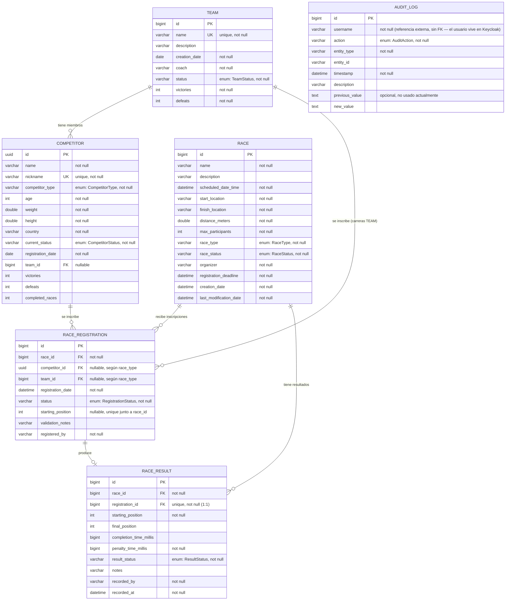

# 🐪 The Great EIA Camel vs. Dwarf Racing System

REST API developed in Java with Spring Boot for managing a racing competition involving camels and dwarfs.

The system manages competitors, teams, races, race registrations, official results, statistics, and standings while enforcing the business rules defined for the competition.

The project uses a layered architecture and PostgreSQL persistence through Docker.

---

## 📌 Project Status

### Implemented and manually tested

| Module / Feature | Status |
|---|---|
| Competitor management | ✅ Implemented and tested |
| Team management | ✅ Implemented and tested |
| Team ↔ Competitor relationship | ✅ Implemented and tested |
| Race management | ✅ Implemented and tested |
| Race lifecycle | ✅ Implemented and tested |
| Race Registration | ✅ Implemented and tested |
| Registration approval | ✅ Implemented and tested |
| Registration business rules | ✅ Implemented and tested |
| Race Results | ✅ Implemented and tested |
| Team results | ✅ Implemented and tested |
| Individual competitor results | ✅ Implemented and tested |
| Penalty and total time calculation | ✅ Implemented and tested |
| Points calculation | ✅ Implemented and tested |
| Competitor statistics | ✅ Implemented and tested |
| Team statistics | ✅ Implemented and tested |
| Standings | ✅ Implemented and tested |
| PostgreSQL persistence | ✅ Implemented and tested |
| PostgreSQL with Docker | ✅ Implemented and tested |
| HTTP error handling | ✅ Implemented |
| Validation | ✅ Implemented |
| Security / Role-based authorization (Keycloak) | ✅ Implemented |
| Audit Log | ✅ Implemented and tested |
| Automated tests | ✅ Implemented (16 tests, 15 required scenarios + context load) |
| Database indexes | ✅ Implemented |
| Entity-Relationship Diagram | ✅ Documented (`database-erd.md`) |
| Backend Docker image | ✅ Implemented and tested |
| Frontend Docker image (Angular production build + nginx) | ✅ Implemented and tested |
| Full Docker Compose stack (DB + Keycloak + backend + frontend) | ✅ Implemented and tested |
| GUI (Angular frontend) | ✅ Implemented |
| Final authentication/authorization integration | ✅ Implemented |

---

# 🛠️ Technologies

- Java 21+
- Spring Boot
- Spring Web
- Spring Data JPA
- Hibernate
- Jakarta Validation
- Spring Security (OAuth2 Resource Server, JWT)
- Keycloak (identity provider)
- springdoc-openapi / Swagger UI
- PostgreSQL
- Docker
- Docker Compose
- Gradle
- Lombok
- PowerShell for manual API testing
- IntelliJ IDEA

Frontend:

- Angular 18 (standalone components, signals)
- TypeScript
- Reactive Forms
- Custom SCSS design system (dark "desert sunset" theme)

---

# 🏗️ Architecture

The backend follows a layered architecture.

```text
Client / GUI
     │
     ▼
Controller
     │
     ▼
Service
     │
     ▼
Repository
     │
     ▼
JPA / Hibernate
     │
     ▼
PostgreSQL
```

Controllers are responsible for receiving HTTP requests and returning responses.

Business rules are implemented in the service layer.

Repositories provide persistence through Spring Data JPA.

Entities are not directly exposed through the REST API. DTOs and mappers are used between the API and persistence layers.

---

# 📂 Project Structure

The main backend structure is organized approximately as follows:

```text
src/main/java/com/parcialimplementacion/parcialenanosvscamellos/

├── common/
│   ├── config/       (OpenApiConfig)
│   └── exceptions/
│
├── security/
│   ├── config/        (SecurityConfig, JWT decoder, CORS)
│   ├── dto/            (LoginRequest, RefreshRequest, UserProfileResponse)
│   └── AuthController.java
│
├── competitor/
│   ├── controller/
│   ├── dto/
│   ├── entity/
│   ├── mapper/
│   ├── repository/
│   ├── service/
│   └── specification/
│
├── team/
│   ├── controller/
│   ├── dto/
│   ├── entity/
│   ├── mapper/
│   ├── repository/
│   ├── service/
│   └── specification/
│
├── race/
│   ├── controller/
│   ├── dto/
│   ├── entity/
│   ├── mapper/
│   ├── repository/
│   ├── service/
│   └── specification/
│
├── registration/
│   ├── controller/
│   ├── dto/
│   ├── entity/
│   ├── mapper/
│   ├── repository/
│   └── service/
│
├── result/
│   ├── controller/
│   ├── dto/
│   ├── entity/
│   ├── mapper/
│   ├── repository/
│   ├── service/
│   └── util/
│
└── standings/
    ├── controller/
    ├── dto/
    └── service/
```

---

# 🗄️ Database

The application currently uses PostgreSQL running inside Docker.

The database container is based on:

```text
postgres:16-alpine
```

Hibernate is currently configured with:

```properties
spring.jpa.hibernate.ddl-auto=update
```

This means that Hibernate creates or updates the required database tables automatically during development.

Tables created by the system:

```text
competitors
teams
races
race_registrations
race_results
audit_logs
```

`users`/`roles` are not tables here — Keycloak owns those.

## Entity-Relationship Diagram



Full version also kept at [`database-erd.md`](./database-erd.md).

---

# 🐳 Dockerized Application

The complete application is containerized with Docker Compose. The stack contains four services:

```text
frontend  → Angular production build served by nginx
backend   → Spring Boot REST API
keycloak  → Authentication and role management
db        → PostgreSQL persistent database
```

The full solution starts from the project root with a single command:

```powershell
docker compose up -d
```

When source code or Dockerfiles have changed, force a rebuild with:

```powershell
docker compose up -d --build
```

Check the status of all containers with:

```powershell
docker compose ps
```

A successful startup should show the four services running. PostgreSQL, Keycloak and the frontend have health checks; the backend appears as `Up` once the Spring Boot container has started.

## Docker ports and addresses

| Component | Host / browser address | Docker-internal address |
|---|---|---|
| Frontend | `http://localhost:4200` | `frontend:80` |
| Backend API | `http://localhost:8080` | `backend:8080` |
| Keycloak | `http://localhost:8081` | `keycloak:8080` |
| PostgreSQL | `localhost:${DB_PORT}` (tested with `5434`) | `db:5432` |

The distinction between host addresses and Docker-internal addresses is important: containers communicate through service names (`db`, `keycloak`, `backend`), while the browser uses the published `localhost` ports.

---

# ⚙️ Environment Variables

Sensitive values must not be committed to the repository. The real `.env` file is ignored by Git and excluded from Docker build contexts through `.dockerignore`. Docker Compose reads it for variable interpolation, but the file itself is **not copied into the backend or frontend images**.

Example `.env.example`:

```env
# Database
DB_HOST=127.0.0.1
DB_NAME=camel_racing
DB_USERNAME=your_database_user
DB_PASSWORD=your_database_password
DB_PORT=5434

# Keycloak
KEYCLOAK_ADMIN=admin
KEYCLOAK_ADMIN_PASSWORD=change_me
KEYCLOAK_PORT=8081
KEYCLOAK_REALM=camel-racing
KEYCLOAK_CLIENT_ID=camel-racing-app
KEYCLOAK_PUBLIC_URL=http://localhost:8081

# Used when the backend runs directly on the host.
# Docker Compose overrides the backend container to use http://keycloak:8080.
KEYCLOAK_INTERNAL_URL=http://localhost:8081

# Frontend origins allowed by the backend
CORS_ALLOWED_ORIGINS=http://localhost:4200
```

Create a local `.env` from `.env.example` and replace only the placeholder credentials with local values.

```text
.env.example  → committed
.env          → NOT committed
```

Inside Docker, `compose.yml` explicitly supplies the backend with the internal service addresses:

```text
PostgreSQL → jdbc:postgresql://db:5432/<database>
Keycloak   → http://keycloak:8080
```

The public Keycloak URL remains `http://localhost:8081` because that is the issuer URL visible to the browser and present in issued tokens.

---

# 🔌 Database Configuration

The application uses environment variables in `application.properties`.

Example:

```properties
spring.application.name=ParcialEnanosvsCamellos

spring.config.import=optional:file:./.env[.properties]

spring.datasource.url=jdbc:postgresql://${DB_HOST:localhost}:${DB_PORT:5432}/${DB_NAME}
spring.datasource.username=${DB_USERNAME}
spring.datasource.password=${DB_PASSWORD}
spring.datasource.driver-class-name=org.postgresql.Driver

spring.jpa.hibernate.ddl-auto=update
spring.jpa.show-sql=true
spring.jpa.properties.hibernate.format_sql=true
spring.jpa.open-in-view=false

spring.web.error.include-stacktrace=never
spring.web.error.include-exception=false
```

---

# ▶️ Running the Application

## Recommended: run the complete stack with Docker

From the project root:

```powershell
docker compose up -d
```

This starts:

```text
PostgreSQL
Keycloak
Spring Boot backend
Angular frontend served by nginx
```

For a clean rebuild after changing code or Docker configuration:

```powershell
docker compose down
docker compose up -d --build
```

Verify the containers:

```powershell
docker compose ps
```

Then open:

```text
Frontend:        http://localhost:4200
Backend API:     http://localhost:8080
Keycloak:        http://localhost:8081
Swagger UI:      http://localhost:8080/swagger-ui/index.html
```

No `bootRun`, `ng serve`, or IntelliJ Run configuration is required for the Dockerized execution path.

## Local development alternative

The backend and frontend may still be run directly on the host during development. Start only PostgreSQL and Keycloak in Docker, then run Spring Boot and Angular locally. In that scenario, the backend must use the host-accessible PostgreSQL and Keycloak addresses from `.env`.

Backend:

```powershell
.\gradlew bootRun
```

Frontend (from `camel-racing-frontend/`):

```powershell
npm install
npx ng serve
```

The Dockerized workflow above is the recommended execution method for final verification and delivery.

---

# ▶️ Running from IntelliJ (green Run button)

This is an optional local-development path, not required for the final Docker execution. If used, ensure PostgreSQL and Keycloak are reachable through the host addresses configured in `.env`.

For final verification, prefer:

```powershell
docker compose up -d
```

---

# ✅ Automated Tests

16 automated tests (JUnit 5 + MockMvc), covering the 15 required scenarios.
Only PostgreSQL needs to be running.

```powershell
.\gradlew test
```

| Test class | Scenarios covered |
|---|---|
| `CompetitorApiTest` | Create a valid competitor · reject invalid weight · reject duplicated nickname |
| `RaceApiTest` | Create a valid race · reject a race scheduled in the past |
| `RegistrationApiTest` | Register an active competitor · reject a suspended competitor · reject a duplicated registration · reject registration after the deadline |
| `ResultApiTest` | Record a valid result · reject two winners in one race |
| `SecurityApiTest` | Prevent a viewer from creating a race · allow an administrator to create a race · 401 without a token · 404 for a missing resource |

---

# 🧪 Manual Testing

Manual integration tests were executed using PowerShell `Invoke-RestMethod`.

The process used was:

```text
PowerShell HTTP Request
        ↓
REST Controller
        ↓
Service
        ↓
Business Rules
        ↓
Repository
        ↓
Hibernate / JPA
        ↓
PostgreSQL
```

Database persistence was additionally verified directly using PostgreSQL commands inside the Docker container.

---

# 🧍 Competitors

Competitors can be created, queried, updated and assigned to teams.

Supported competitor types include:

```text
CAMEL
DWARF
```

Competitor status includes values such as:

```text
ACTIVE
RETIRED
```

The system also maintains statistics including:

```text
victories
defeats
completedRaces
```

---

## Example: Create Competitor

```powershell
$body = @{
    name = "Byte"
    nickname = "byte-camel"
    competitorType = "CAMEL"
    age = 10
    weight = 450.0
    height = 2.1
    country = "Colombia"
} | ConvertTo-Json
```

```powershell
Invoke-RestMethod `
    -Method Post `
    -Uri "http://localhost:8080/api/competitors" `
    -ContentType "application/json" `
    -Body $body
```

---

## Example: Get Competitors

```powershell
Invoke-RestMethod `
    -Method Get `
    -Uri "http://localhost:8080/api/competitors"
```

---

# 👥 Teams

Teams can be created and can contain competitors.

A competitor cannot simultaneously belong to multiple active teams.

Teams also maintain race statistics:

```text
victories
defeats
```

---

## Example: Create Team

```powershell
$teamBody = @{
    name = "The Five Exceptions"
    description = "Test team"
    coach = "Ada Coach"
} | ConvertTo-Json
```

```powershell
$team = Invoke-RestMethod `
    -Method Post `
    -Uri "http://localhost:8080/api/teams" `
    -ContentType "application/json" `
    -Body $teamBody
```

---

## Add Competitor to Team

```powershell
Invoke-RestMethod `
    -Method Post `
    -Uri "http://localhost:8080/api/teams/$teamId/members/$competitorId"
```

The relationship was verified directly in PostgreSQL.

---

# 🏁 Races

Races support a lifecycle controlled through race status.

Possible statuses include:

```text
DRAFT
OPEN_FOR_REGISTRATION
CLOSED_FOR_REGISTRATION
IN_PROGRESS
COMPLETED
CANCELLED
```

Valid lifecycle example:

```text
DRAFT
  ↓
OPEN_FOR_REGISTRATION
  ↓
CLOSED_FOR_REGISTRATION
  ↓
IN_PROGRESS
  ↓
COMPLETED
```

Cancellation is also supported from valid intermediate states.

---

## Important Race Rules

Some implemented rules include:

- A race cannot start without at least two approved participants.
- Registration must occur before the registration deadline.
- Registrations can only occur while the race is open.
- A completed race cannot continue changing state.
- A race cannot be completed without official results.
- A race in progress or completed cannot be deleted.
- Invalid state transitions are rejected.

---

## Example: Create Race

```powershell
$raceDate = (Get-Date).AddDays(7).ToString("yyyy-MM-ddTHH:mm:ss")
$deadline = (Get-Date).AddDays(6).ToString("yyyy-MM-ddTHH:mm:ss")

$raceBody = @{
    name = "First Mixed Race"
    description = "Integration test race"
    scheduledDateTime = $raceDate
    startLocation = "Universidad EIA"
    finishLocation = "Alto de Las Palmas"
    distanceMeters = 1000
    maxParticipants = 10
    raceType = "MIXED"
    organizer = "Test Organizer"
    registrationDeadline = $deadline
} | ConvertTo-Json
```

```powershell
$race = Invoke-RestMethod `
    -Method Post `
    -Uri "http://localhost:8080/api/races" `
    -ContentType "application/json" `
    -Body $raceBody
```

---

# 📝 Race Registration

Race Registration supports both:

```text
Individual Competitor
Team
```

Registration statuses:

```text
PENDING
APPROVED
REJECTED
CANCELLED
```

---

## Implemented Registration Rules

The system validates:

- Registration is only allowed for an open race.
- Registration must occur before the deadline.
- A competitor or team cannot be registered twice in the same race.
- Starting positions cannot be duplicated.
- Only eligible competitors and teams can register.
- Race participant type must be compatible with race type.
- A participant cannot participate individually and as part of a team in the same race.
- Rejected registrations require validation information.
- Race capacity must not be exceeded.

---

## Registration Endpoints

```text
POST   /api/races/{raceId}/registrations
GET    /api/races/{raceId}/registrations
GET    /api/registrations/{id}
PATCH  /api/registrations/{id}/approve
PATCH  /api/registrations/{id}/reject
DELETE /api/registrations/{id}
```

---

## Example: Register Team

```powershell
$teamRegistrationBody = @{
    teamId = $teamId
    startingPosition = 1
    registeredBy = "test-organizer"
} | ConvertTo-Json
```

```powershell
Invoke-RestMethod `
    -Method Post `
    -Uri "http://localhost:8080/api/races/$raceId/registrations" `
    -ContentType "application/json" `
    -Body $teamRegistrationBody
```

The initial registration status is:

```text
PENDING
```

---

## Approve Registration

```powershell
Invoke-RestMethod `
    -Method Patch `
    -Uri "http://localhost:8080/api/registrations/$registrationId/approve"
```

The new status becomes:

```text
APPROVED
```

---

# 🏆 Race Results

Official race results can only be created for approved participants while the race is:

```text
IN_PROGRESS
```

Supported result statuses:

```text
FINISHED
DISQUALIFIED
DID_NOT_FINISH
DID_NOT_START
```

Each result contains information such as:

```text
race
registration
starting position
final position
completion time
penalty time
result status
notes
recorded by
recorded timestamp
```

---

# ⏱️ Time Calculation

For finished participants:

```text
totalTimeMillis =
completionTimeMillis + penaltyTimeMillis
```

Example:

```text
completionTimeMillis = 65000
penaltyTimeMillis    = 1000

totalTimeMillis      = 66000
```

---

# 🥇 Result Rules

Implemented validations include:

- Results can only be entered while the race is `IN_PROGRESS`.
- Only approved registrations may receive official results.
- A registration can only have one official result.
- Normal final positions cannot be duplicated.
- Completion time must be positive.
- Only one participant may finish in position `1`.
- `FINISHED` requires a final position.
- `FINISHED` requires a completion time.
- A participant marked `DID_NOT_START` cannot have a completion time.
- Results cannot be modified once the race is completed.

---

# 🎯 Points System

The scoring table is:

| Position | Points |
|---:|---:|
| 1st | 10 |
| 2nd | 7 |
| 3rd | 5 |
| 4th | 3 |
| 5th | 1 |
| Other | 0 |

Only participants with:

```text
resultStatus = FINISHED
```

receive position points.

---

# 🏆 Result Endpoints

```text
POST /api/races/{raceId}/results
GET  /api/races/{raceId}/results
GET  /api/results/{id}
PUT  /api/results/{id}
```

---

## Example: Team Result

```powershell
$teamResultBody = @{
    registrationId = 1
    resultStatus = "FINISHED"
    finalPosition = 1
    completionTimeMillis = 60000
    penaltyTimeMillis = 0
    notes = "Team finished first"
    recordedBy = "test-organizer"
} | ConvertTo-Json
```

```powershell
Invoke-RestMethod `
    -Method Post `
    -Uri "http://localhost:8080/api/races/$raceId/results" `
    -ContentType "application/json" `
    -Body $teamResultBody
```

Expected result:

```text
finalPosition        : 1
completionTimeMillis : 60000
penaltyTimeMillis    : 0
totalTimeMillis      : 60000
resultStatus         : FINISHED
points               : 10
```

---

## Example: Individual Result

```powershell
$competitorResultBody = @{
    registrationId = 2
    resultStatus = "FINISHED"
    finalPosition = 2
    completionTimeMillis = 65000
    penaltyTimeMillis = 1000
    notes = "Competitor finished second"
    recordedBy = "test-organizer"
} | ConvertTo-Json
```

Expected result:

```text
finalPosition        : 2
completionTimeMillis : 65000
penaltyTimeMillis    : 1000
totalTimeMillis      : 66000
points               : 7
```

---

# 📊 Standings

The application automatically calculates standings from official race results.

Competitors and teams have independent rankings.

Available endpoints:

```text
GET /api/standings
GET /api/standings/competitors
GET /api/standings/teams
```

---

## Example

```powershell
$standings = Invoke-RestMethod `
    -Method Get `
    -Uri "http://localhost:8080/api/standings"

$standings | ConvertTo-Json -Depth 6
```

Example output:

```json
{
  "competitors": [
    {
      "rank": 1,
      "name": "Null Pointer",
      "nickname": "null-pointer",
      "points": 7,
      "victories": 0,
      "secondPlaces": 1,
      "thirdPlaces": 0,
      "racesWithResults": 1
    }
  ],
  "teams": [
    {
      "rank": 1,
      "name": "The Five Exceptions",
      "points": 10,
      "victories": 1,
      "secondPlaces": 0,
      "thirdPlaces": 0,
      "racesWithResults": 1
    }
  ]
}
```

---

# 📈 Statistics

Official results automatically update participant statistics.

For competitors:

```text
victories
defeats
completedRaces
```

Example tested result:

```text
Null Pointer

victories      : 0
defeats        : 1
completedRaces : 1
```

For teams:

```text
victories
defeats
```

Example tested result:

```text
The Five Exceptions

victories : 1
defeats   : 0
```

---

# 🚫 Business Rule Error Handling

The application uses centralized exception handling.

Expected HTTP statuses include:

```text
400 Bad Request
404 Not Found
409 Conflict
```

Examples of operations that return `409 Conflict` include:

- Duplicate registration.
- Duplicate starting position.
- Duplicate final position.
- More than one race winner.
- Invalid race status transition.
- Entering results for a race that is not in progress.
- Editing official results after the race has been completed.

Spring stack traces are disabled from normal API responses.

---

# ✅ Manual Tests Performed

The following flows were manually tested successfully:

```text
Competitor                         ✅ tested
Team                               ✅ tested
Team ↔ Competitor                  ✅ tested
Race                               ✅ tested
RaceRegistration                   ✅ tested
PENDING → APPROVED                 ✅ tested
minimum 2 approved to start        ✅ tested
duplicate starting position → 409  ✅ tested
RaceResult TEAM                    ✅ tested
RaceResult COMPETITOR              ✅ tested
penalty and total time             ✅ tested
points 10 / 7                      ✅ tested
PostgreSQL persistence             ✅ tested
Standings                          ✅ tested
statistics update                  ✅ tested
Race → COMPLETED with results      ✅ tested
duplicate winner → 409             ✅ tested
edit result after COMPLETED → 409  ✅ tested
```

---

# 🔎 PostgreSQL Verification

Persistence was not only validated through API responses.

The database was queried directly inside the Docker container.

## Competitors

```powershell
docker compose exec db psql `
    -U your_database_user `
    -d camel_racing `
    -c "select * from competitors;"
```

---

## Registrations

```powershell
docker compose exec db psql `
    -U your_database_user `
    -d camel_racing `
    -c "select * from race_registrations;"
```

---

## Results

```powershell
docker compose exec db psql `
    -U your_database_user `
    -d camel_racing `
    -c "select * from race_results;"
```

This allowed verification that API operations were actually persisted in PostgreSQL.

---

# 🔐 Security

Authentication and authorization are implemented with **Keycloak** as the
identity provider and **Spring Security (OAuth2 Resource Server / JWT)** on
the backend. Keycloak issues and signs the tokens; the backend only
validates them (signature, issuer, expiration) and enforces roles. No
password is ever stored or checked by this application.

## Roles

| Role | Permissions |
|---|---|
| `ADMINISTRATOR` | Full access: manage competitors, teams, races, registrations, results and audit records. |
| `RACE_ORGANIZER` | Manage races, registrations and results. Read-only on competitors and teams. |
| `VIEWER` | Read-only on all public information: competitors, teams, races, results and standings. |

## Endpoint authorization

| Route group | GET | POST / PUT / PATCH / DELETE |
|---|---|---|
| `/api/competitors/**`, `/api/teams/**` | Any authenticated role | `ADMINISTRATOR` only |
| `/api/races/**`, `/api/registrations/**`, `/api/results/**` | Any authenticated role | `ADMINISTRATOR` or `RACE_ORGANIZER` |
| `/api/standings/**` | Any authenticated role | — (read-only resource) |
| `/api/audit/**` | `ADMINISTRATOR` only | — |
| `/swagger-ui/**`, `/v3/api-docs/**`, `/actuator/health`, `/api/auth/login`, `/api/auth/refresh` | Public | Public |

A missing or invalid token returns `401 Unauthorized`. A valid token
without the required role returns `403 Forbidden`. Both are returned in the
same structured JSON error format as the rest of the API.

## Test users (seeded by `keycloak/realm-export.json`)

| Username | Password | Role |
|---|---|---|
| `admin` | `Admin123!` | `ADMINISTRATOR` |
| `organizer` | `Organizer123!` | `RACE_ORGANIZER` |
| `viewer` | `Viewer123!` | `VIEWER` |


## Auth endpoints

```text
POST /api/auth/login    { "username": "...", "password": "..." }  → access_token, refresh_token
POST /api/auth/refresh  { "refreshToken": "..." }                 → new access_token
GET  /api/auth/profile  (Authorization: Bearer <token>)           → subject, username, email, roles
```

User creation/registration is **not** exposed by this API: with an
external identity provider, creating and disabling users is an
administration task performed in Keycloak (admin console or its own API),
not a responsibility of this backend. The three seed users above are
enough for development, testing and the demo video.

## Example: log in and call a protected endpoint

```powershell
$login = Invoke-RestMethod `
    -Method Post `
    -Uri "http://localhost:8080/api/auth/login" `
    -ContentType "application/json" `
    -Body (@{ username = "admin"; password = "Admin123!" } | ConvertTo-Json)

$token = $login.access_token

Invoke-RestMethod `
    -Method Get `
    -Uri "http://localhost:8080/api/competitors" `
    -Headers @{ Authorization = "Bearer $token" }
```

## Swagger UI

Open http://localhost:8080/swagger-ui.html, click **Authorize**, and log
in with one of the test users above. Swagger then sends the token
automatically on every "Try it out" call.

## 🌱 Sample Data

`scripts/seed.ps1` creates sample competitors, teams and races through the
API. Run it from the project root with the backend running:

```powershell
.\scripts\seed.ps1
```

## How Docker networking is configured

The backend now runs inside the same Docker network as PostgreSQL and Keycloak. Two different kinds of addresses are therefore used:

- **Public / browser addresses:** `localhost` plus the published host port.
- **Container-to-container addresses:** Docker Compose service name plus the container's internal port.

For Keycloak this means:

```text
Browser / token issuer: http://localhost:8081
Backend → Keycloak:    http://keycloak:8080
```

The backend validates the public issuer while fetching Keycloak signing keys through the internal Docker address. `SecurityConfig` uses the separate public and internal Keycloak settings for this purpose.

For PostgreSQL:

```text
Host tools → PostgreSQL: localhost:${DB_PORT}
Backend → PostgreSQL:   db:5432
```

The backend service waits for both `db` and `keycloak` to report healthy before it is started by Docker Compose.

`registeredBy` and `recordedBy` are still sent directly by the client on
registration and result requests instead of being derived from the
authenticated JWT — see [Known Limitations](#-known-limitations) below.

---

# 🧾 Audit Log

Records every successful state-changing request (username, action, entity
type/id, timestamp, description). Read access is restricted to
`ADMINISTRATOR`:

```text
GET /api/audit?username=...&entityType=...&action=...&page=...
```

---

# 🖥️ Frontend (Angular GUI)

The graphical interface is implemented as a standalone Angular 18
application located in `camel-racing-frontend/`, at the project root.

It communicates exclusively with the REST API described in this document —
it never touches PostgreSQL or Keycloak directly. Authentication is done
through the backend's own `/api/auth/login` endpoint (which in turn talks
to Keycloak); the frontend just stores the resulting access/refresh tokens
and attaches the access token to every request via an HTTP interceptor.

## Stack

- Angular 18, standalone components (no NgModules), signals
- Angular Router with lazy-loaded routes and role-based route guards
- Reactive Forms
- A custom SCSS theme (dark, cinematic "desert sunset" palette)

## Implemented flows

```text
Login (JWT via /api/auth/login)
Dashboard
Competitors      (full CRUD)
Teams            (full CRUD + member management)
Races            (full CRUD + lifecycle status transitions)
Registrations    (register / approve / reject / cancel, inside race detail)
Results          (record results, inside race detail)
Standings
```

Write actions (create/edit/delete, status changes, approvals, result entry)
are shown or hidden in the UI based on the logged-in user's role
(`ADMINISTRATOR` / `RACE_ORGANIZER` / `VIEWER`), matching the same
permissions enforced server-side in [Security](#-security). The UI gating
is a convenience only — the backend is the real authorization boundary.

## Running the frontend

For the final Dockerized setup, the Angular project is compiled with a production build and served by nginx. It is started automatically with the rest of the stack:

```powershell
docker compose up -d
```

Open:

```text
http://localhost:4200
```

The browser continues to call the backend at `http://localhost:8080`. Inside the frontend image, `ng serve` is **not** used; the production files generated by Angular are served by nginx.

For local frontend development only, `npx ng serve` can still be used from `camel-racing-frontend/`.

Log in with any of the [test users](#test-users-seeded-by-keycloakrealm-exportjson)
seeded in Keycloak (`admin` / `organizer` / `viewer`).

---

# 🐳 Final Dockerization

Dockerization is complete and manually verified. The project includes:

```text
Dockerfile                         → multi-stage Spring Boot backend build
.dockerignore                      → excludes local/build/sensitive files
camel-racing-frontend/Dockerfile   → multi-stage Angular production build + nginx
camel-racing-frontend/.dockerignore
camel-racing-frontend/nginx.conf   → SPA routing support
compose.yml                        → db + keycloak + backend + frontend
```

The backend image is built in a JDK stage and executed from a smaller JRE-only runtime stage. The frontend is compiled in a Node stage and the resulting static files are served from nginx.

The complete system was verified with:

```powershell
docker compose down
docker compose up -d --build
docker compose ps
```

The verified services were:

```text
PostgreSQL  → running / healthy
Keycloak    → running / healthy
Backend     → running on port 8080
Frontend    → running / healthy on port 4200
```

For subsequent starts, the required single command is:

```powershell
docker compose up -d
```

---

# 🔄 Current Execution Workflow

```text
1. docker compose up -d
          ↓
2. PostgreSQL and Keycloak become healthy
          ↓
3. Spring Boot backend starts inside Docker
          ↓
4. Angular production frontend is served by nginx
          ↓
5. Open http://localhost:4200
          ↓
6. Log in with a seeded Keycloak test user
          ↓
7. Frontend calls the REST API at http://localhost:8080
          ↓
8. Backend persists data in PostgreSQL through db:5432
```

---

# 🧹 Stop the Application

Stop all application containers with:

```powershell
docker compose down
```

This keeps the PostgreSQL named volume and therefore preserves database data.

Do **not** add `-v` unless the intention is to delete the persisted database volume and start with an empty database.

---

# 🌐 Main API Routes

Current main API areas:

```text
/api/auth
/api/competitors
/api/teams
/api/races
/api/races/{raceId}/registrations
/api/registrations
/api/races/{raceId}/results
/api/results
/api/standings
```

---

# 📌 Important Notes

- The complete application can run without `bootRun` or `ng serve` by using `docker compose up -d`.
- PostgreSQL uses internal port `5432`; the published host port comes from `DB_PORT` in `.env` (the verified local setup used `5434`).
- Keycloak is published on `8081`, the backend on `8080`, and the frontend on `4200`.
- Inside Docker, the backend connects to PostgreSQL at `db:5432` and Keycloak at `keycloak:8080`.
- `.env` is Git-ignored and excluded from Docker images; `.env.example` contains placeholder values only.
- The frontend image uses an Angular production build served by nginx, not the Angular development server.

---

# 👩‍💻 Development Progress

Current backend domain flow:

```text
Competitor ✅
     │
     ▼
Team ✅
     │
     ▼
Race ✅
     │
     ▼
RaceRegistration ✅
     │
     ▼
RaceResult ✅
     │
     ▼
Statistics ✅
     │
     ▼
Standings ✅
     │
     ▼
Security (Keycloak) ✅
     │
     ▼
Audit Log ✅
     │
     ▼
Automated Tests ✅
     │
     ▼
GUI (Angular) ✅
```

Dockerization status:

```text
PostgreSQL ✅
Keycloak   ✅
Backend    ✅
Frontend   ✅
Full stack ✅ docker compose up -d
```

---

# ⚠️ Known Limitations

- `registeredBy` / `recordedBy` are sent by the client instead of derived from the JWT.
- Audit log `previousValue` is not populated.

# 🚀 Future Improvements

- Derive `registeredBy`/`recordedBy` from the authenticated JWT.
- Frontend automated tests.

---

# 📦 Repository

Clone the repository:

```bash
git clone https://github.com/Nats306/ParcialImplementacion.git
```

Enter the project directory:

```bash
cd ParcialImplementacion
```

Then follow the Docker and application startup instructions described above.

---

# 👥 Authors

Developed as part of the implementation project for the EIA racing system assignment.

- Miguel Ángel Fonseca Restrepo
- Natalia Mejía Devia
