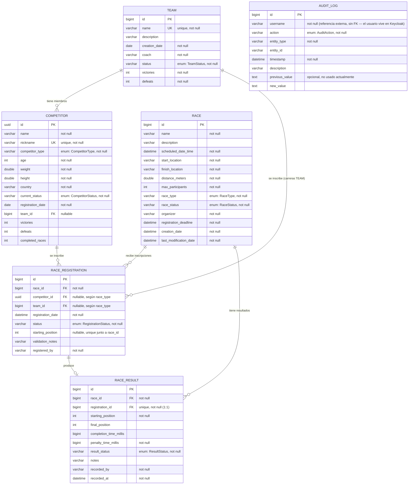

# Diagrama Entidad-Relación — Camel vs Dwarf Racing System

> `User` y `Role` no son entidades de este esquema: viven en Keycloak (identity provider externo). La app nunca persiste usuarios ni contraseñas propias; `AuditLog.username` guarda el username como texto plano (no hay FK a una tabla de usuarios porque no existe en esta base de datos).



## Notas

- **User / Role**: intencionalmente fuera de este diagrama. Keycloak es la única fuente de verdad para usuarios, roles y contraseñas; la app solo valida JWTs. `AuditLog.username` es un valor de texto capturado del token, no una FK.
- **RACE_REGISTRATION** también tiene tres unique constraints compuestas (todas empiezan por `race_id`): `(race_id, competitor_id)`, `(race_id, team_id)` y `(race_id, starting_position)` — evitan doble inscripción del mismo competidor/equipo en la misma carrera y posiciones de salida repetidas.
- **Índices ya agregados** (commiteados a tu proyecto) en las 6 tablas — `competitors`, `teams`, `races`, `race_registrations`, `race_results` y `audit_logs`: cada FK simple que Postgres no indexa solo (porque no es PK ni cabeza de una unique constraint) y cada columna usada como filtro común (status, type, fechas) ahora tiene su `@Index`.
- Este archivo es Markdown puro con un bloque ` ```mermaid `: si lo pegas en tu `README.md` de GitHub, el diagrama se renderiza solo — GitHub soporta Mermaid nativamente.
